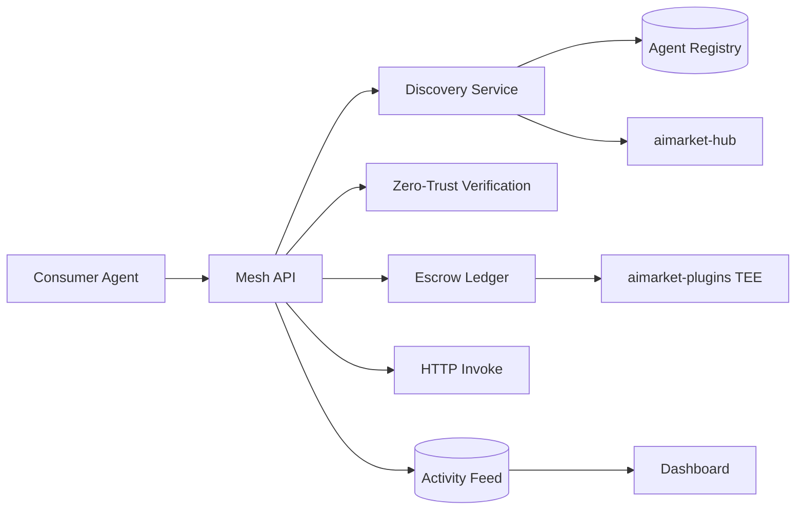

# Architecture — AI Service Mesh

## Overview

AI Service Mesh is a **control plane** for agent-to-agent commerce. It does not replace LLM inference; it coordinates **who** executes work, **whether** they are trusted, and **how** payment is held and released.

## Components

### Mesh API (`ai_service_mesh/api.py`)

FastAPI application with fail-closed CORS, Bearer auth, rate limiting, and security headers. Exposes REST + SSE activity stream.

### Discovery (`discovery.py`)

1. **Local registry** — verified agents with capability matching and trust-weighted scoring.
2. **Federated hub** — optional `MESH_HUB_URL` search against AIMarket v2 (`/ai-market/v2/search`).

### Verification (`verification.py`)

Zero-trust registration checks:

- HTTPS endpoint with DNS-resolving SSRF guard (same class of protection as `aimarket-hub` crawler).
- Valid PEM public key (RSA or Ed25519).
- Attestation digest over canonical agent metadata.

Agents start `pending` and move to `verified` when checks pass.

### Orchestrator (`orchestrator.py`)

Implements the **Auto-Mesh Pipeline** for `aicom`:

| Phase | Activity event |
|-------|----------------|
| Discovery | `mesh.discovery` |
| Verification | `mesh.verification` |
| Escrow | `mesh.escrow` |
| Invoke | `mesh.invoke` |
| Settle | `mesh.settle` |

### Payments (`payments.py`)

v0.1 uses an in-memory escrow ledger for development. Production swaps to **TEE Escrow** via `aimarket-plugins` and on-chain `AIMarketEscrow`.

### Persistence (`db.py`, `db_backend.py`)

Same pattern as **AIMarket Hub**: SQLite by default (`MESH_DATA_DIR/mesh.db`), PostgreSQL when `MESH_DATABASE_URL` or `DATABASE_URL` is set. DDL is SQLite-first; `sqlite_to_pg()` translates at runtime. Migrate existing data with `scripts/migrate_sqlite_to_postgres.py`.

## Deployment topology

| Tier | Stack |
|------|--------|
| Dev | Single process + SQLite + Vite dashboard |
| Prod | Docker Compose or K8s: API replicas, Postgres, Redis rate-limit, ingress TLS |

## Future standalone repo

This directory is self-contained (`backend/`, `frontend/`, `docs/`, `docker-compose.yml`). Extraction steps:

1. Copy `ai-service-mesh/` to new Git remote.
2. Wire CI (pytest, locust smoke, Docker build).
3. Point `MESH_HUB_URL` at production hub.
